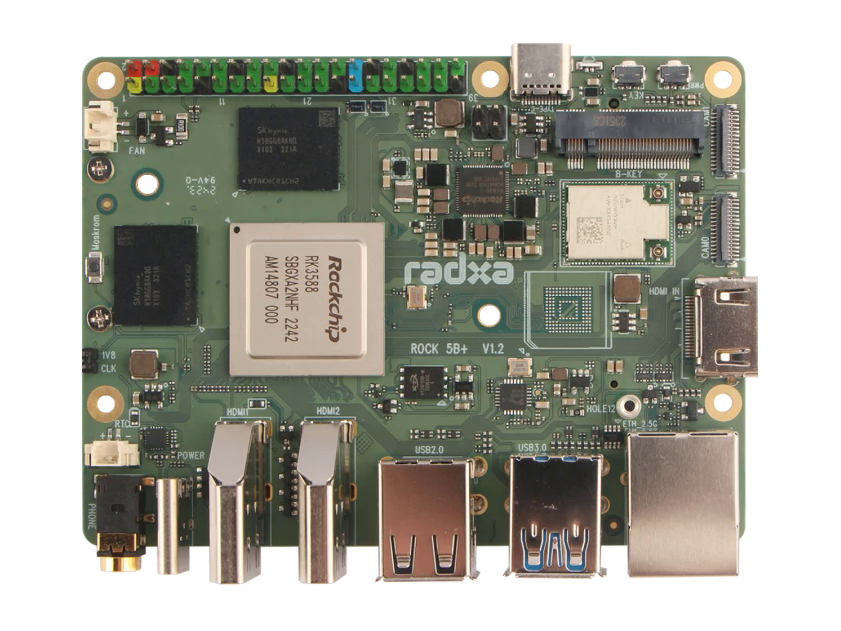

# Radxa Rock 5B+

[](https://hex.pm/packages/nerves_system_rock_5b_plus)
[](https://hexdocs.pm/nerves_system_rock_5b_plus/)

This is the base Nerves system definition for the [Radxa Rock 5B+](https://radxa.com/products/rock5/5bp/).


<br><sup>[Radxa Website](https://radxa.com/rock5/rock_5b+/banner_rock5bp.webp)</sup>

| Feature              | Description                      |
| -------------------- | -------------------------------- |
| CPU                  | Quad-core Cortex-A76 up to 2.4GHz / Quad-small-core Cortex-A55 up to 1.8GHz     |
| Memory               | 4/8/16/32 64 GB LPDDR5           |
| Storage              | Onboard eMMC / MicroSD           |
| Linux kernel         | 6.1 w/ Radxa patches             |
| IEx terminal         | HDMI and USB keyboard (can be changed to UART) |
| GPIO, I2C, SPI       | Yes - [Elixir Circuits](https://github.com/elixir-circuits) |
| ADC                  | No                               |
| PWM                  | Yes, but no Elixir support       |
| UART                 | `ttyFIQ0`                        |
| Display              | HDMI or 7" RPi Touchscreen       |
| Camera               | Untested                         |
| Ethernet             | Yes - 2.5G Ethernet with PoE support (PoE requires hat)  |
| WiFi                 | Yes - VintageNet                 |
| Bluetooth            | Untested                         |
| Audio                | HDMI/Stereo out                  |

## Using

The most common way of using this Nerves System is create a project with `mix
nerves.new` and to export `MIX_TARGET=rock_5bp`. See the [Getting started
guide](https://hexdocs.pm/nerves/getting-started.html#creating-a-new-nerves-app)
for more information.

If you need custom modifications to this system for your device, clone this
repository and update as described in [Making custom
systems](https://hexdocs.pm/nerves/customizing-systems.html).

## Supported WiFi devices

The Radxa Rock 5B+ comes with a Realtek RTL8852BE WiFi/BT module. Unfortunately, 
there's no driver in the radxa kerenl (6.1) for this device. So, we're using an out-of-tree
driver `rtw89`.

Currently the module is not loaded automatically. To load the driver, run the following command:
```elixir
cmd "modprobe rtw89_8852be_git"
```

## Linux kernel configuration

The Linux kernel compiled for Nerves is a stripped down version of the default
Radxa Linux kernel. This is done to remove unnecessary features, select
some Nerves-specific features like F2FS and SquashFS support, and to save space.
